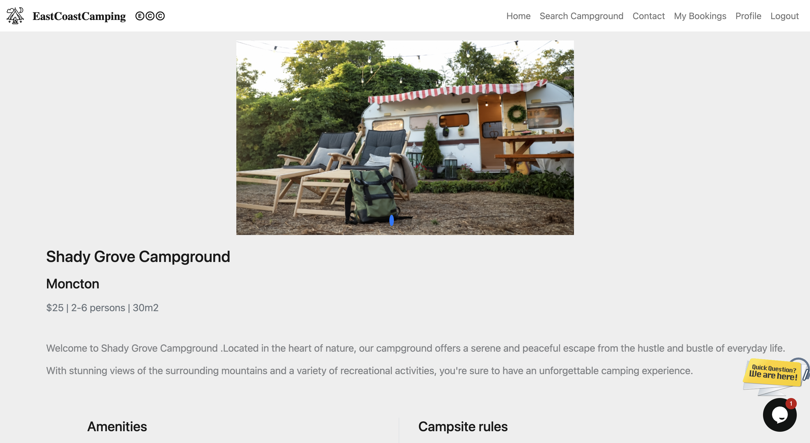
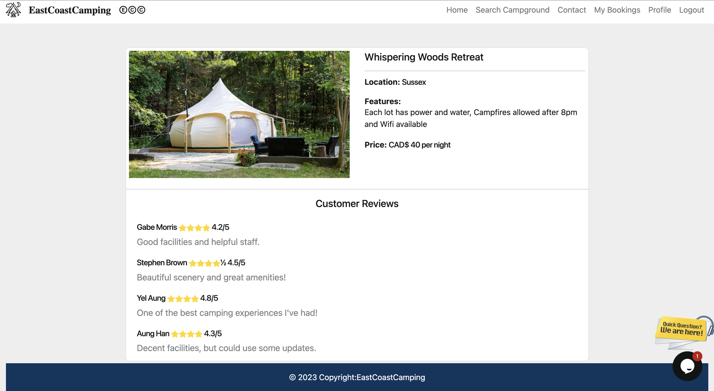

# EastCoastCamping

## Description:
  
A React application that uses Graphql and a mongodb database. It allows users to create accounts, search for campgrounds, 
add camps to favorites, look at reviews, and make a reservations.
  - Our motivation for this project was to combat the lack of websites that feature exclusively local campgrounds on the east coast. 
  - Building this project we learned how to use graphql with our mongodb database, and use React components.
  

## Installation:

This project's frontend is deployed on Vercel, while the backend (GraphQL API) is hosted on [Render](https://render.com/).
🔗 Live Site: [east-coast-camping.vercel.app](https://east-coast-camping.vercel.app/)

This repository was originally started at this [GitHub](https://github.com/Mo2207) with the intention of providing a centralized location for project collaboration and version control.

## Screenshots of Application

## Credits:

This project was built by:

[Aung Han](https://github.com/Aungphyohan5)
[Yel Aung](https://github.com/Yelzaw)
[Gabe Morris](https://github.com/Mo2207)
[Stephen Brown](https://github.com/stephenrbrownnb)

## License:

MIT license
