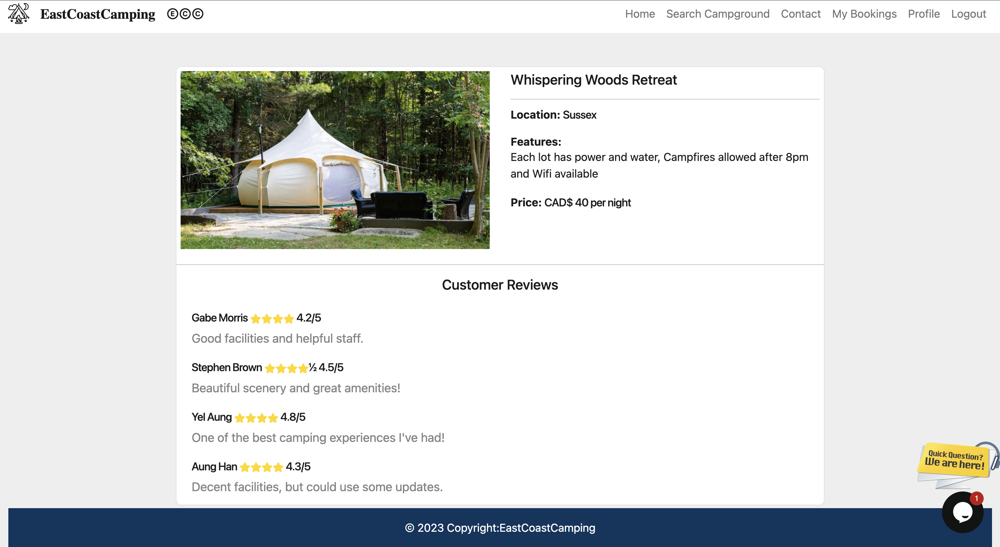
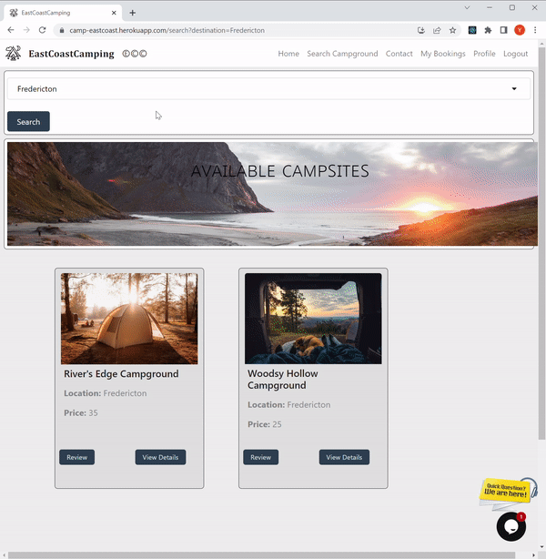
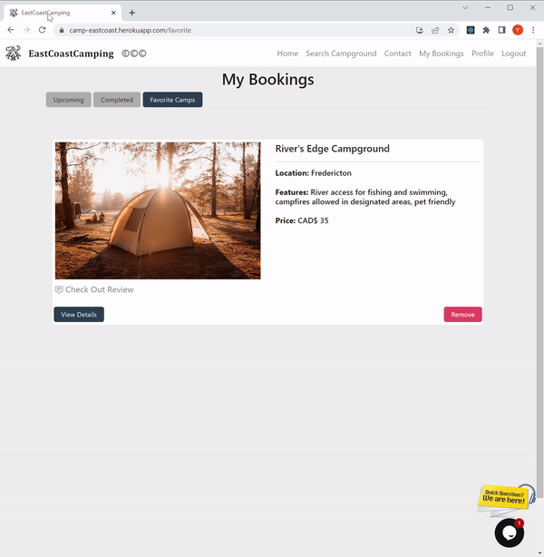

# EastCoastCamping


## Description:
  
A React application that uses Graphql and a mongodb database. It allows users to create accounts, search for campgrounds, 
add camps to favorites, look at reviews, and make a reservations.
  - Our motivation for this project was to combat the lack of websites that feature exclusively local campgrounds on the east coast. 
  - Building this project we learned how to use graphql with our mongodb database, and use React components.
  
## Installation:
To use this application, first you will need to clone this repository from Github and install necessary dependencies, run the following command:

`````
npm i
`````
And you will need to run the following command to insert existing database
`````
npm run seed
`````
And you can use the following command to run the application.
`````
npm run develop
`````

This live project can be viewed on heroku here: https://east-coast-camping.herokuapp.com/

This repository was originally started at this [GitHub](https://github.com/Mo2207) with the intention of providing a centralized location for project collaboration and version control.


## Screenshots of Application




## Demo of Application





## Credits:
This project was built by:

[Aung Han](https://github.com/Aungphyohan5)

[Yel Aung](https://github.com/Yelzaw)

[Gabe Morris](https://github.com/Mo2207)

[Stephen Brown](https://github.com/stephenrbrownnb)


## License:
MIT license
